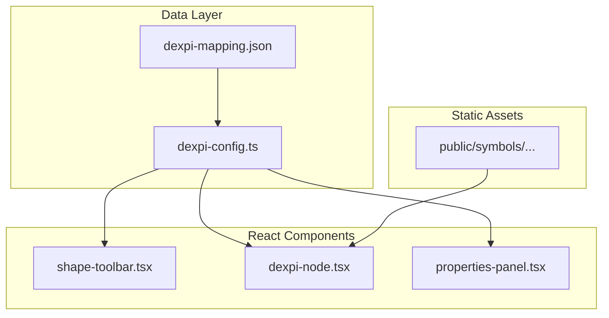

# DEXPI SVG Integration for PFD Mode

## Current State

- **vibe-engineer**: Has 10 simple PFD node types rendered as colored CSS shapes
- **pid-mining**: Has 24 DEXPI categories with 465 SVG symbols and complete mapping

## Architecture




## Key Files to Create/Modify

### 1. Copy SVG Assets

Copy `pid-mining/visual-paradigm-symbols/Process_Engineering/` to `vibe-engineer/public/symbols/`

### 2. Create DEXPI Configuration

**New file**: `src/lib/dexpi-config.ts`

- Import and process the DEXPI mapping JSON
- Export typed interfaces for categories, symbols, and subtypes
- Provide helper functions: `getCategorySymbols()`, `getDefaultSymbol()`, `getSymbolPath()`

### 3. Create DEXPI Node Component

**New file**: `src/components/nodes/dexpi-node.tsx`

- Generic node component that renders any DEXPI SVG
- Uses `next/image` or inline SVG to render the symbol
- Stores `dexpiCategory` and `symbolIndex` in node data
- Shows label below the symbol
- Supports all 4 handles (top, bottom, left, right)

### 4. Update Shape Toolbar

**Modify**: `src/components/toolbar/shape-toolbar.tsx`

- Add collapsible category sections for PFD mode
- Each category shows the default SVG icon
- Expandable to show all subtypes/variants
- Drag-and-drop passes `dexpiCategory` and `symbolIndex`

### 5. Update Properties Panel

**Modify**: `src/components/sidebar/properties-panel.tsx`

- Add "Symbol Variant" dropdown when a DEXPI node is selected
- Shows all available symbols for that category with descriptions
- Preview of selected symbol in dropdown

### 6. Update Mode Configuration

**Modify**: `src/lib/modes.ts`

- Update PFD `availableNodeTypes` to use DEXPI category names (e.g., `pump`, `vessel`, `heat_exchanger`)
- Use lowercase/snake_case to match existing convention

### 7. Update Diagram Store

**Modify**: `src/hooks/use-diagram-store.ts`

- Extend node data type to include optional `dexpiCategory`, `symbolIndex`, `dexpiSubclass`

### 8. Update AI Tools

**Modify**: `src/lib/ai-tools.ts` and `src/lib/ai-prompt.ts`

- Update `add_node` tool to accept DEXPI equipment types
- Include DEXPI class names in system prompt for voice commands

## Node Data Structure

```typescript
interface DexpiNodeData {
  label: string;
  description?: string;
  properties?: Record<string, string>;
  // DEXPI-specific
  dexpiCategory?: string;      // e.g., "Pumps"
  symbolIndex?: number;        // e.g., 0-17 for pumps
  dexpiSubclass?: string;      // e.g., "CentrifugalPump"
}
```

## Toolbar UX

- Categories collapsed by default showing default symbol
- Click chevron to expand and see all variants
- Each variant shows SVG thumbnail + description
- Drag any variant to canvas

## Symbol Path Convention

```
/symbols/{CategoryName}/{CategoryName}_{index}.svg
e.g., /symbols/Pumps/Pumps_1.svg
```

