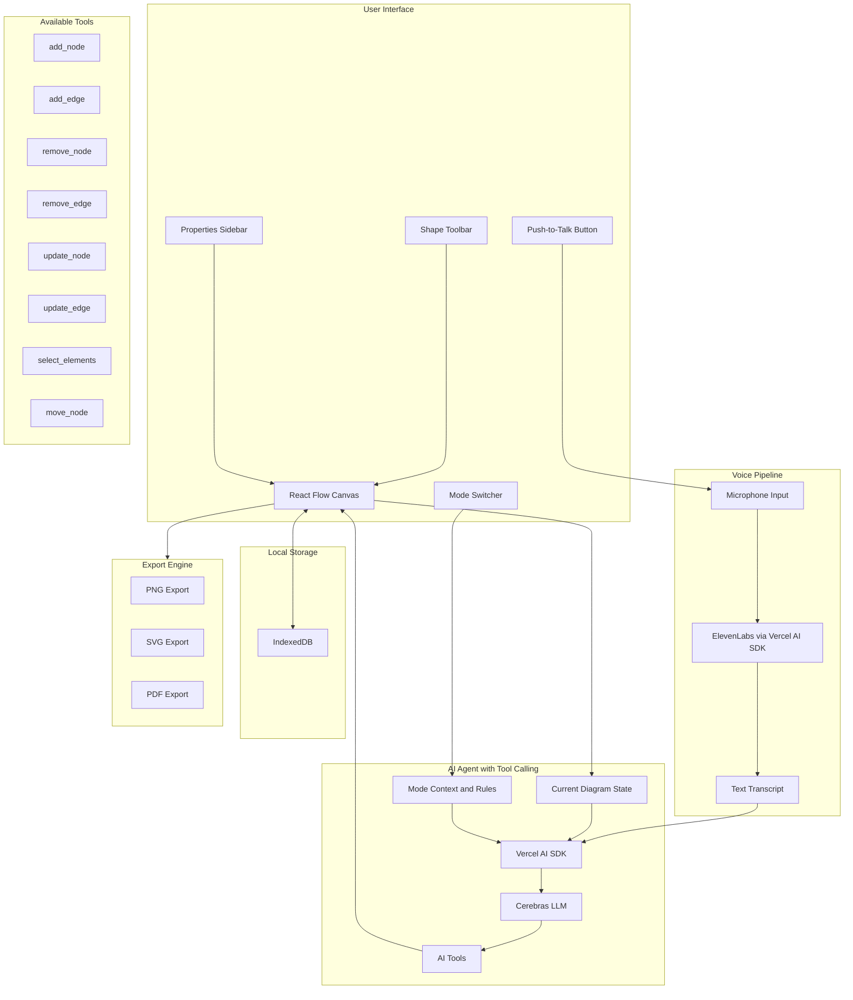

# Voice-First Process Engineering Diagramming App

## Architecture Overview



---

## Tech Stack

| Layer | Technology |

|-------|------------|

| Framework | Next.js 15 (App Router, TypeScript) |

| Diagram Canvas | React Flow |

| Styling | Tailwind CSS + shadcn/ui |

| Voice Input | Vercel AI SDK + @ai-sdk/elevenlabs (scribe_v1) |

| AI Processing | Vercel AI SDK + @ai-sdk/cerebras (llama-3.3-70b) with tool calling |

| Local Storage | IndexedDB (via idb library) |

| Export | html-to-image + jsPDF |

---

## Mode Switcher

The app supports three modes, each with different available symbols and rulesets. The active mode determines what the AI knows about available shapes and rules.

### Mode Definitions (`lib/modes.ts`)

```typescript
export type DiagramMode = "playground" | "bfd" | "pfd";

export interface ModeConfig {
  id: DiagramMode;
  name: string;
  description: string;
  availableNodeTypes: string[];
  availableEdgeTypes: string[];
  rules: string[];
}

export const MODES: Record<DiagramMode, ModeConfig> = {
  playground: {
    id: "playground",
    name: "Playground",
    description: "Free-form diagramming with all shapes available",
    availableNodeTypes: ["rectangle", "circle", "diamond", "triangle", "text"],
    availableEdgeTypes: ["default", "arrow", "dashed"],
    rules: [
      "No restrictions - any shape can connect to any other shape",
      "Labels are optional",
      "Freeform positioning allowed",
    ],
  },
  bfd: {
    id: "bfd",
    name: "Block Flow Diagram",
    description: "Simplified process overview showing major units and streams",
    availableNodeTypes: ["process_block", "input_output", "storage"],
    availableEdgeTypes: ["material_stream", "energy_stream", "signal"],
    rules: [
      "Each block represents a major process unit or group of units",
      "Streams show main material and energy flows",
      "Labels should include stream names and key parameters (flow rate, temp)",
      "Left-to-right flow direction is conventional",
      "Blocks should have unique identifiers (e.g., UNIT-100)",
    ],
  },
  pfd: {
    id: "pfd",
    name: "Process Flow Diagram",
    description: "Detailed process diagram with equipment and instrumentation",
    availableNodeTypes: [
      "reactor", "tank", "vessel", "pump", "compressor",
      "heat_exchanger", "column", "valve", "mixer", "splitter",
    ],
    availableEdgeTypes: ["material_stream", "energy_stream", "utility_stream"],
    rules: [
      "Equipment should have tag numbers (e.g., R-101, P-201, E-301)",
      "Streams must have stream numbers and key properties",
      "Material streams show flow direction with arrows",
      "Equipment sizing info can be added to labels",
      "Utility streams (steam, cooling water) use different line styles",
    ],
  },
};
```

### Mode Switcher UI (`components/mode-switcher.tsx`)

- Dropdown selector in the toolbar area
- Switching modes updates the available shapes in the toolbar
- Mode context is automatically included in every AI request

---

## AI Tools Definition (Cerebras Tool Calling)

The AI agent uses Vercel AI SDK's **tool calling** feature with Cerebras. This is critical for reliable, structured command execution.

### Why Tool Calling Instead of Structured Output?

- Cerebras supports tool calling natively via `@ai-sdk/cerebras`
- Tools allow the LLM to call multiple actions in sequence
- Better error handling and validation via Zod schemas
- More natural mapping to diagram operations

### Tool Definitions (`lib/ai-tools.ts`)

```typescript
import { tool } from "ai";
import { z } from "zod";

export const diagramTools = {
  add_node: tool({
    description: "Add a new node/equipment to the diagram",
    parameters: z.object({
      nodeType: z.string().describe("Type of node (e.g., reactor, tank, pump, process_block)"),
      label: z.string().describe("Display label for the node (e.g., R-101, Feed Tank)"),
      position: z.object({
        x: z.number().describe("X coordinate on canvas"),
        y: z.number().describe("Y coordinate on canvas"),
      }).optional().describe("Position on canvas. If omitted, auto-place intelligently"),
      data: z.record(z.string()).optional().describe("Additional properties: capacity, temperature, pressure"),
    }),
    execute: async ({ nodeType, label, position, data }) => {
      // This will be handled by the command executor
      return { success: true, nodeId: `node_${Date.now()}`, nodeType, label, position, data };
    },
  }),

  add_edge: tool({
    description: "Add a connection/stream between two nodes",
    parameters: z.object({
      sourceNodeId: z.string().describe("ID of the source node (where stream originates)"),
      targetNodeId: z.string().describe("ID of the target node (where stream goes)"),
      edgeType: z.string().optional().describe("Type: material_stream, energy_stream, utility_stream"),
      label: z.string().optional().describe("Stream label (e.g., '500 kg/hr, 25C')"),
      data: z.record(z.string()).optional().describe("Stream properties: flowRate, temperature, pressure"),
    }),
    execute: async ({ sourceNodeId, targetNodeId, edgeType, label, data }) => {
      return { success: true, edgeId: `edge_${Date.now()}`, sourceNodeId, targetNodeId, edgeType, label, data };
    },
  }),

  remove_node: tool({
    description: "Remove a node from the diagram. Also removes all connected edges.",
    parameters: z.object({
      nodeId: z.string().describe("ID of the node to remove"),
    }),
    execute: async ({ nodeId }) => {
      return { success: true, removedNodeId: nodeId };
    },
  }),

  remove_edge: tool({
    description: "Remove a connection/stream from the diagram",
    parameters: z.object({
      edgeId: z.string().describe("ID of the edge to remove"),
    }),
    execute: async ({ edgeId }) => {
      return { success: true, removedEdgeId: edgeId };
    },
  }),

  update_node: tool({
    description: "Update properties of an existing node",
    parameters: z.object({
      nodeId: z.string().describe("ID of the node to update"),
      label: z.string().optional().describe("New label for the node"),
      position: z.object({
        x: z.number(),
        y: z.number(),
      }).optional().describe("New position for the node"),
      data: z.record(z.string()).optional().describe("Updated properties"),
    }),
    execute: async ({ nodeId, label, position, data }) => {
      return { success: true, nodeId, updates: { label, position, data } };
    },
  }),

  update_edge: tool({
    description: "Update properties of an existing edge/stream",
    parameters: z.object({
      edgeId: z.string().describe("ID of the edge to update"),
      label: z.string().optional().describe("New label for the stream"),
      edgeType: z.string().optional().describe("New edge type"),
      data: z.record(z.string()).optional().describe("Updated stream properties"),
    }),
    execute: async ({ edgeId, label, edgeType, data }) => {
      return { success: true, edgeId, updates: { label, edgeType, data } };
    },
  }),

  select_elements: tool({
    description: "Select one or more elements on the canvas",
    parameters: z.object({
      nodeIds: z.array(z.string()).optional().describe("Node IDs to select"),
      edgeIds: z.array(z.string()).optional().describe("Edge IDs to select"),
      clearPrevious: z.boolean().default(true).describe("Clear previous selection first"),
    }),
    execute: async ({ nodeIds, edgeIds, clearPrevious }) => {
      return { success: true, selected: { nodeIds, edgeIds }, clearPrevious };
    },
  }),

  move_node: tool({
    description: "Move a node to a new position or relative to another node",
    parameters: z.object({
      nodeId: z.string().describe("ID of the node to move"),
      position: z.object({
        x: z.number(),
        y: z.number(),
      }).optional().describe("Absolute position to move to"),
      relativeTo: z.object({
        referenceNodeId: z.string().describe("ID of reference node"),
        direction: z.enum(["left", "right", "above", "below"]),
        offset: z.number().default(150).describe("Distance in pixels"),
      }).optional().describe("Move relative to another node"),
    }),
    execute: async ({ nodeId, position, relativeTo }) => {
      return { success: true, nodeId, position, relativeTo };
    },
  }),

  clear_canvas: tool({
    description: "Clear all nodes and edges from the canvas",
    parameters: z.object({
      confirm: z.boolean().describe("Must be true to confirm clearing"),
    }),
    execute: async ({ confirm }) => {
      if (!confirm) return { success: false, reason: "Confirmation required" };
      return { success: true, cleared: true };
    },
  }),
};
```

### Cerebras Tool Calling Behavior

#### Strict Mode

Cerebras supports **strict mode** for tool calling, which guarantees that tool call arguments exactly match your schema through constrained decoding. This prevents:

- Wrong parameter types (e.g., `"2"` instead of `2`)
- Missing required parameters
- Unexpected extra parameters
- Malformed argument JSON

When using the Vercel AI SDK, strict mode is enabled by default when you define tools with Zod schemas. The SDK translates Zod schemas to JSON Schema with `additionalProperties: false`, which Cerebras requires for strict mode.

#### Parallel Tool Calling

Cerebras supports **parallel tool calling**, allowing the model to call multiple tools simultaneously. This is useful for commands like:

- "Add a reactor and a tank" → calls `add_node` twice in parallel
- "Connect R-101 to T-102 and label it 500 kg/hr" → may call `add_edge` and `update_edge` together

In the Vercel AI SDK, parallel tool calling is handled automatically. The `toolCalls` array in the response may contain multiple calls that can be executed concurrently.

#### Multi-turn Tool Calling

For complex commands that require multiple sequential steps, Cerebras supports **multi-turn tool calling**. The model can:

1. Call a tool and receive its result
2. Decide if more tool calls are needed
3. Continue calling tools until satisfied
4. Generate a final response

In Vercel AI SDK, this is controlled via `maxSteps`:

```typescript
const { toolCalls, toolResults } = await generateText({
  model: cerebras("llama-3.3-70b"),
  tools: diagramTools,
  maxSteps: 5, // Allow up to 5 sequential tool calls
  // ...
});
```

**Example multi-step command:** "Add a reactor R-101, then add a tank T-102 to its right, then connect them"

1. Step 1: `add_node` (reactor R-101)
2. Step 2: `add_node` (tank T-102, positioned relative to R-101)
3. Step 3: `add_edge` (connect R-101 → T-102)

---

## Diagram State Representation for AI

The current diagram state **must always** be sent to the AI with every voice command request. This enables the AI to understand context like "connect the reactor to the tank" or "delete the selected item".

### State Serialization (`lib/diagram-state.ts`)

```typescript
import { Node, Edge, Viewport } from "reactflow";
import { DiagramMode, MODES } from "./modes";

export interface SerializedNode {
  id: string;
  type: string;
  label: string;
  position: { x: number; y: number };
  data?: Record<string, string>;
}

export interface SerializedEdge {
  id: string;
  type: string;
  sourceId: string;
  targetId: string;
  label?: string;
  data?: Record<string, string>;
}

export interface DiagramStateForAI {
  mode: DiagramMode;
  modeName: string;
  modeRules: string[];
  availableNodeTypes: string[];
  availableEdgeTypes: string[];
  nodes: SerializedNode[];
  edges: SerializedEdge[];
  selectedNodeIds: string[];
  selectedEdgeIds: string[];
}

export function serializeDiagramForAI(
  nodes: Node[],
  edges: Edge[],
  mode: DiagramMode,
  selectedNodes: string[],
  selectedEdges: string[]
): DiagramStateForAI {
  const modeConfig = MODES[mode];
  
  return {
    mode,
    modeName: modeConfig.name,
    modeRules: modeConfig.rules,
    availableNodeTypes: modeConfig.availableNodeTypes,
    availableEdgeTypes: modeConfig.availableEdgeTypes,
    nodes: nodes.map((n) => ({
      id: n.id,
      type: n.type || "default",
      label: (n.data?.label as string) || n.id,
      position: { x: Math.round(n.position.x), y: Math.round(n.position.y) },
      data: n.data,
    })),
    edges: edges.map((e) => ({
      id: e.id,
      type: e.type || "default",
      sourceId: e.source,
      targetId: e.target,
      label: typeof e.label === "string" ? e.label : undefined,
      data: e.data,
    })),
    selectedNodeIds: selectedNodes,
    selectedEdgeIds: selectedEdges,
  };
}
```

### AI System Prompt (`lib/ai-prompt.ts`)

The system prompt is dynamically built with the current diagram state:

```typescript
export function buildSystemPrompt(state: DiagramStateForAI): string {
  const nodesSection = state.nodes.length === 0 
    ? "Canvas is empty - no nodes yet."
    : state.nodes.map((n) => 
        `- "${n.label}" (id: ${n.id}, type: ${n.type}) at (${n.position.x}, ${n.position.y})`
      ).join("\n");

  const edgesSection = state.edges.length === 0
    ? "No connections yet."
    : state.edges.map((e) => 
        `- ${e.label || "[unlabeled]"}: ${e.sourceId} → ${e.targetId} (id: ${e.id}, type: ${e.type})`
      ).join("\n");

  const selectionSection = [
    state.selectedNodeIds.length > 0 ? `Selected nodes: ${state.selectedNodeIds.join(", ")}` : null,
    state.selectedEdgeIds.length > 0 ? `Selected edges: ${state.selectedEdgeIds.join(", ")}` : null,
  ].filter(Boolean).join("\n") || "Nothing selected.";

  return `You are an AI assistant for a process engineering diagramming application.

## CURRENT MODE: ${state.modeName.toUpperCase()}

### Mode Rules:
${state.modeRules.map((r) => `- ${r}`).join("\n")}

### Available Node Types:
${state.availableNodeTypes.join(", ")}

### Available Edge Types:
${state.availableEdgeTypes.join(", ")}

## CURRENT DIAGRAM STATE

### Nodes:
${nodesSection}

### Connections:
${edgesSection}

### Selection:
${selectionSection}

## INSTRUCTIONS

1. Use the provided tools to modify the diagram based on the user's voice command
2. For ambiguous references like "the reactor" or "it", infer from context or selected elements
3. When adding nodes without explicit position, place them logically:
   - If canvas is empty, place near center (x: 400, y: 300)
   - Otherwise, place to the right of the rightmost node with some offset
4. Follow the mode-specific rules listed above
5. You can call multiple tools in sequence if the command requires it
6. Generate descriptive IDs (e.g., "reactor_r101" or "pump_p201")
7. When the user says "selected" or "this", operate on the selected elements`;
}
```

---

## Voice Pipeline Implementation

### ElevenLabs STT via Vercel AI SDK (`lib/voice.ts`)

```typescript
import { experimental_transcribe as transcribe } from "ai";
import { elevenlabs } from "@ai-sdk/elevenlabs";

export async function transcribeAudio(audioData: Uint8Array): Promise<string> {
  const { text } = await transcribe({
    model: elevenlabs.transcription("scribe_v1"),
    audio: audioData,
    providerOptions: {
      elevenlabs: {
        languageCode: "en",
        tagAudioEvents: false,
      },
    },
  });
  
  return text;
}
```

### AI Command Processing (`app/api/voice-command/route.ts`)

```typescript
import { generateText } from "ai";
import { cerebras } from "@ai-sdk/cerebras";
import { diagramTools } from "@/lib/ai-tools";
import { buildSystemPrompt } from "@/lib/ai-prompt";
import { DiagramStateForAI } from "@/lib/diagram-state";

export async function POST(req: Request) {
  const { transcript, diagramState } = await req.json() as {
    transcript: string;
    diagramState: DiagramStateForAI;
  };
  
  const systemPrompt = buildSystemPrompt(diagramState);
  
  // generateText handles both parallel and multi-turn tool calling:
  // - Parallel: Multiple tools in toolCalls array executed concurrently
  // - Multi-turn: maxSteps allows sequential tool call rounds
  const { text, toolCalls, toolResults, steps } = await generateText({
    model: cerebras("llama-3.3-70b"),
    system: systemPrompt,
    prompt: transcript,
    tools: diagramTools,
    maxSteps: 5, // Allow up to 5 rounds of tool calls for complex commands
  });
  
  // toolResults contains all executed tool calls across all steps
  // Each result has: toolCallId, toolName, args, result
  return Response.json({
    transcript,
    response: text,
    toolCalls,
    toolResults,
    steps, // Array of each step for debugging/logging
  });
}
```

---

## Core Components

### 1. Diagram Canvas (`components/diagram-canvas.tsx`)

React Flow instance with:

- Custom node types for each equipment type
- Custom edge types for streams with labels
- Drag-and-drop from toolbar
- Selection, multi-select, copy/paste
- Zoom, pan, minimap
- Emits state changes to keep AI context in sync

### 2. Voice Controller (`components/voice-controller.tsx`)

- Push-to-talk button (spacebar or click)
- MediaRecorder for audio capture
- Visual feedback during recording
- Sends audio to transcription endpoint

### 3. Process Equipment Node Types

**Playground Mode:**

| Shape | Description |

|-------|-------------|

| Rectangle | Generic block |

| Circle | Generic circular shape |

| Diamond | Decision/routing |

| Triangle | Directional indicator |

**Block Flow Diagram (BFD) Mode:**

| Node Type | Description |

|-----------|-------------|

| process_block | Major process unit or group |

| input_output | Feed or product stream terminal |

| storage | Storage tank or inventory |

**Process Flow Diagram (PFD) Mode:**

| Equipment | Shape | Color |

|-----------|-------|-------|

| Reactor | Rectangle | Blue |

| Tank/Vessel | Rounded Rectangle | Cyan |

| Pump | Circle | Green |

| Heat Exchanger | Diamond | Orange |

| Valve | Small Square | Gray |

| Mixer/Splitter | Triangle | Purple |

| Column | Tall Rectangle | Teal |

| Compressor | Pentagon | Yellow |

### 4. Stream Edges

- Animated flow direction arrows
- Label support (flow rate, temperature, composition)
- Styles: solid (material), dashed (energy), dotted (utility)

---

## File Structure

```
app/
├── page.tsx                    # Main app page
├── layout.tsx                  # Root layout
├── api/
│   ├── transcribe/
│   │   └── route.ts            # ElevenLabs STT endpoint
│   └── voice-command/
│       └── route.ts            # Cerebras tool calling endpoint
components/
├── diagram-canvas.tsx          # React Flow canvas wrapper
├── voice-controller.tsx        # Push-to-talk + recording
├── mode-switcher.tsx           # Playground/BFD/PFD selector
├── toolbar/
│   └── shape-toolbar.tsx       # Draggable equipment shapes
├── nodes/
│   ├── reactor-node.tsx
│   ├── tank-node.tsx
│   ├── pump-node.tsx
│   ├── process-block-node.tsx
│   └── ...
├── edges/
│   └── stream-edge.tsx         # Custom labeled edge
├── sidebar/
│   └── properties-panel.tsx    # Edit selected node properties
├── export/
│   └── export-menu.tsx         # PNG/SVG/PDF export
lib/
├── modes.ts                    # Mode definitions and rules
├── ai-tools.ts                 # Cerebras tool definitions
├── ai-prompt.ts                # System prompt builder
├── diagram-state.ts            # State serialization for AI
├── storage.ts                  # IndexedDB operations
├── voice.ts                    # ElevenLabs transcription wrapper
hooks/
├── use-diagram-store.ts        # Zustand store for diagram state
├── use-voice-commands.ts       # Voice recording hook
├── use-mode.ts                 # Current mode state
```

---

## Required Dependencies

```bash
pnpm add reactflow zustand idb html-to-image jspdf
pnpm add ai @ai-sdk/cerebras @ai-sdk/elevenlabs
pnpm add zod
pnpm add -D @types/node
```

Plus shadcn components:

```bash
npx shadcn@latest add button card dialog dropdown-menu input label separator tooltip select
```

---

## Environment Variables

```env
ELEVENLABS_API_KEY=your_elevenlabs_api_key
CEREBRAS_API_KEY=your_cerebras_api_key
```

---

## Development Phases

**Phase 1**: Basic canvas with React Flow, custom nodes, manual drag-and-drop, mode switcher

**Phase 2**: Voice input with ElevenLabs STT via Vercel AI SDK

**Phase 3**: Cerebras tool calling integration with diagram state context

**Phase 4**: Local storage persistence with IndexedDB

**Phase 5**: Export functionality (PNG, SVG, PDF, JSON)

**Phase 6**: Polish UI, add keyboard shortcuts, improve node styling